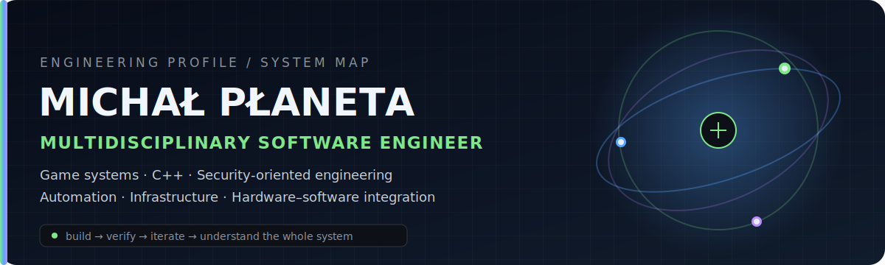
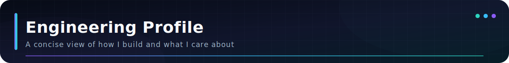
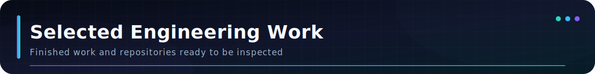
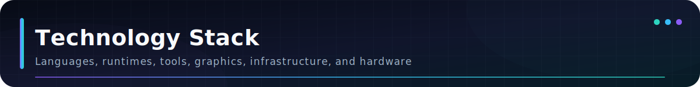
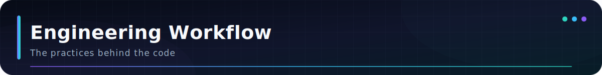
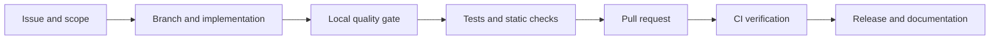
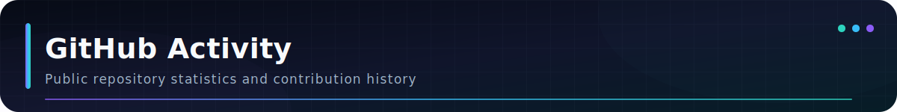
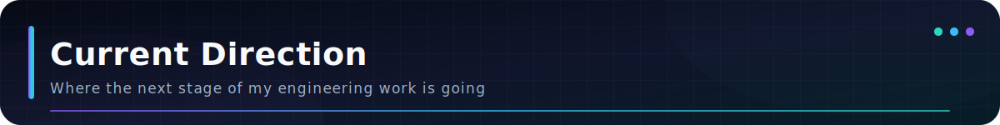
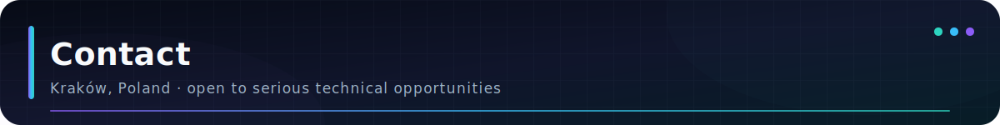

<div align="center">



<br>

<a href="https://github.com/MichalPlanetaDev">
  
</a>

<br>

[](https://github.com/MichalPlanetaDev)
[](https://linkedin.com/in/micha%C5%82-p%C5%82aneta-4b5701235)
[](mailto:michalplanetabiznes@gmail.com)

<br>


</div>

---

<div align="center">

[Profile](#engineering-profile) · [Projects](#selected-engineering-work) · [Stack](#technology-stack) · [Workflow](#engineering-workflow) · [Stats](#github-activity) · [Direction](#current-direction) · [Contact](#contact)

</div>

---



## Engineering Profile

```text
michal@wsl:~$ whoami
Software engineer working across systems, games, security, tooling, graphics, and hardware.

michal@wsl:~$ cat priorities.txt
Correctness. Reproducibility. Clear architecture. Honest technical claims.

michal@wsl:~$ cat current-focus.txt
C++ systems engineering, deterministic simulation, game technology, CI/CD, and defensive security.
```

I like projects where the interesting part is not only what appears on screen, but why the system behaves reliably. The repository should show that clearly through its architecture, tests, setup, documentation, and known limitations.

<table>
<tr>
<td width="25%" align="center"><b>Systems</b><br><sub>Deterministic runtimes, protocols, replay, persistence, and performance.</sub></td>
<td width="25%" align="center"><b>Game Technology</b><br><sub>Gameplay systems, physics, rendering, tools, and realtime interaction.</sub></td>
<td width="25%" align="center"><b>Security</b><br><sub>Validation, trust boundaries, evidence integrity, and defensive design.</sub></td>
<td width="25%" align="center"><b>Delivery</b><br><sub>Linux workflows, CI/CD, tests, Docker, documentation, and releases.</sub></td>
</tr>
</table>

---



## Selected Engineering Work

### Tickline

<div align="center">

<a href="https://github.com/MichalPlanetaDev/tickline">
  
</a>

<br>


</div>

Tickline is my main systems project. A C++23 fixed-step simulation acts as the source of truth, while the rest of the repository handles command validation, tamper-evident records, replay, investigation data, analytics, developer tooling, visualization, automated checks, and reproducible builds.

<div align="center">

[](https://github.com/MichalPlanetaDev/tickline)

</div>

<br>

<table>
<tr>
<td width="50%" valign="top">

### Space Invaders Adventure

A browser-based 3D space-combat project with Babylon.js, WebGPU-to-WebGL fallback, first-person and third-person flight, enemy waves, component damage, weapon heat, cinematic transitions, and automated browser checks.

<br>


</td>
<td width="50%" valign="top">

### Signal Forge

An interactive signal and oscilloscope-style application focused on procedural visualization, readable controls, responsive UI, and the relationship between generated data and realtime presentation.

<br>


</td>
</tr>
<tr>
<td width="50%" valign="top">

### Unity Game Collection

Several complete academic game projects covering platforming, top-down combat, endless gameplay, physics, tilemaps, enemy behaviour, scene flow, UI, animation, audio, and reusable gameplay systems.

<br>


</td>
<td width="50%" valign="top">

### Electronics and Physical Computing

Hands-on work with soldering, THT and PCB assembly, digital circuits, timers, counters, displays, light sensors, and software-assisted data processing for physical systems.

<br>


</td>
</tr>
</table>

---



## Technology Stack

<div align="center">

### Languages


<br><br>


### Game Development, Realtime, and Graphics


<br><br>


### Web, Applications, and Backend


<br><br>


### Data, Testing, and Automation


<br><br>


### Systems, DevOps, and Engineering Tools


<br><br>


</div>

---



## Engineering Workflow

<div align="center">



</div>

<table>
<tr>
<td align="center" width="20%"><b>Linux first</b><br><sub>Ubuntu, WSL, Bash, tmux, CLI tooling.</sub></td>
<td align="center" width="20%"><b>Testable</b><br><sub>Unit, integration, browser, and deterministic checks.</sub></td>
<td align="center" width="20%"><b>Reproducible</b><br><sub>Documented setup, Docker, clean-install validation.</sub></td>
<td align="center" width="20%"><b>Reviewable</b><br><sub>Issues, branches, commits, PR-style workflow.</sub></td>
<td align="center" width="20%"><b>Operational</b><br><sub>CI gates, releases, debugging notes, limitations.</sub></td>
</tr>
</table>

---



## GitHub Activity

<div align="center">


<br>


<br>


</div>

<sub>Language cards describe the composition of public repositories, not a proficiency ranking.</sub>

---



## Current Direction

```mermaid
graph TB
    A[Engineering Focus] --> B[C++ Systems]
    A --> C[Game Technology]
    A --> D[Security Engineering]
    A --> E[Platform and Delivery]
    A --> F[Applied Research]

    B --> B1[Deterministic simulation]
    B --> B2[Memory and concurrency]
    B --> B3[Performance and tooling]

    C --> C1[Game networking]
    C --> C2[Rendering and shaders]
    C --> C3[Physics and engine systems]

    D --> D1[Protocol hardening]
    D --> D2[Evidence and replay]
    D --> D3[Defensive anti-cheat research]

    E --> E1[Backend and distributed systems]
    E --> E2[Cloud and observability]
    E --> E3[CI/CD and production debugging]

    F --> F1[AI and machine learning]
    F --> F2[Embedded systems and robotics]
    F --> F3[Graphics and simulation]
```



---



## Contact

<div align="center">

I am most interested in technically serious work where software must remain understandable, testable, reliable, and maintainable after the first successful demo.

<br><br>

[](https://linkedin.com/in/micha%C5%82-p%C5%82aneta-4b5701235)
[](mailto:michalplanetabiznes@gmail.com)
[](https://github.com/MichalPlanetaDev?tab=repositories)

<br><br>


<br><br>


</div>
