 

<table>
  <tr>
    <td width="50%" valign="top">
      
    </td>

    <td width="50%" valign="top">
      
    </td>
  </tr>
</table>

 

<table>
  <tr>
    <td width="50%" valign="top">
      
    </td>

    <td width="50%" valign="top">
      
    </td>
  </tr>
</table>

 

