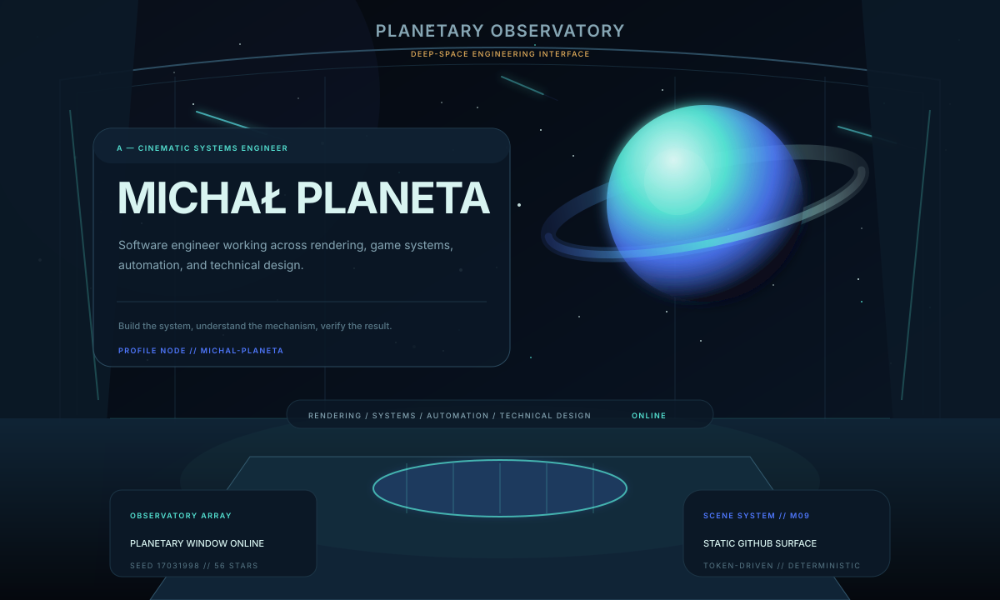
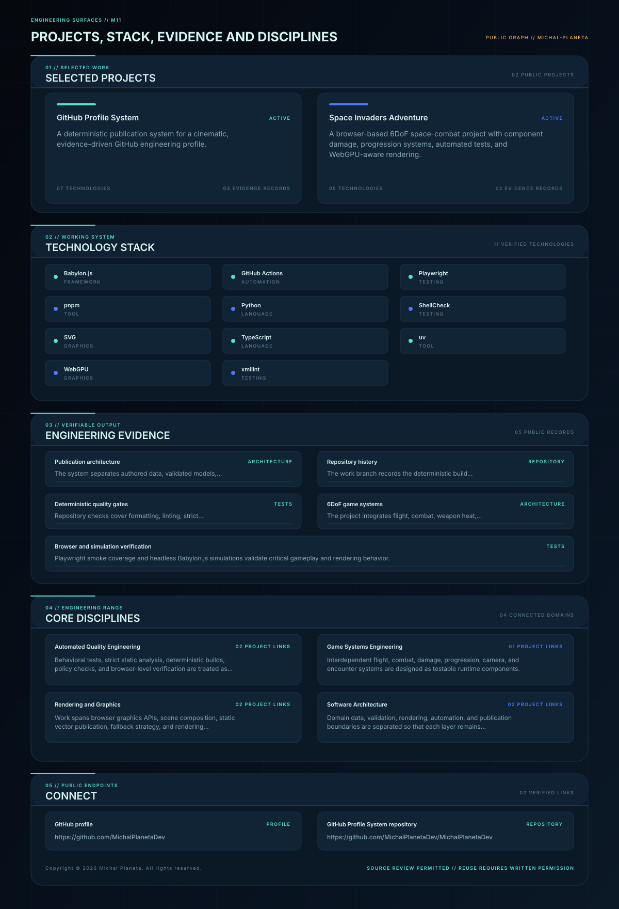

<!-- profile-system:begin -->

  

 

  

 

<strong>Text-only engineering profile</strong>

<strong>A — CINEMATIC SYSTEMS ENGINEER</strong>

<strong>Michał Planeta</strong>

Software engineer working across rendering, game systems, automation, and technical design.

Michał Planeta develops software from architecture and low-level behavior through tooling, validation, and presentation.

<em>Build the system, understand the mechanism, verify the result.</em>

<h3>Selected projects</h3>

<a href="https://github.com/MichalPlanetaDev/MichalPlanetaDev"><strong>GitHub Profile System</strong></a>

A deterministic publication system for a cinematic, evidence-driven GitHub engineering profile.

<strong>Space Invaders Adventure</strong>

A browser-based 6DoF space-combat project with component damage, progression systems, automated tests, and WebGPU-aware rendering.

<h3>Technology evidence</h3>

<code>Babylon.js</code> <code>GitHub Actions</code> <code>Playwright</code> <code>pnpm</code> <code>Python</code> <code>ShellCheck</code> <code>SVG</code> <code>TypeScript</code> <code>uv</code> <code>WebGPU</code> <code>xmllint</code>

<h3>Engineering evidence</h3>

<strong>Publication architecture</strong> <code>ARCHITECTURE</code> The system separates authored data, validated models, public projection, deterministic generation, and later presentation layers.

<strong>Repository history</strong> <code>REPOSITORY</code> The work branch records the deterministic build foundation, static SVG capability probe, tests, and publication safeguards.

<strong>Deterministic quality gates</strong> <code>TESTS</code> Repository checks cover formatting, linting, strict typing, behavioral tests, shell validation, XML validation, and byte-identical regeneration.

<strong>6DoF game systems</strong> <code>ARCHITECTURE</code> The project integrates flight, combat, weapon heat, component damage, enemy waves, progression, and first-person and third-person presentation.

<strong>Browser and simulation verification</strong> <code>TESTS</code> Playwright smoke coverage and headless Babylon.js simulations validate critical gameplay and rendering behavior.

<h3>Engineering disciplines</h3>

<strong>Automated Quality Engineering</strong> Behavioral tests, strict static analysis, deterministic builds, policy checks, and browser-level verification are treated as part of implementation rather than post-processing.

<strong>Game Systems Engineering</strong> Interdependent flight, combat, damage, progression, camera, and encounter systems are designed as testable runtime components.

<strong>Rendering and Graphics</strong> Work spans browser graphics APIs, scene composition, static vector publication, fallback strategy, and rendering verification.

<strong>Software Architecture</strong> Domain data, validation, rendering, automation, and publication boundaries are separated so that each layer remains independently testable and replaceable.

<h3>Connect</h3>

<a href="https://github.com/MichalPlanetaDev">GitHub profile</a> &nbsp;·&nbsp; <a href="https://github.com/MichalPlanetaDev/MichalPlanetaDev">GitHub Profile System repository</a>

  Copyright © 2026 Michał Planeta. All rights reserved. Source review is permitted; reuse requires prior written permission. See <a href="./LICENSE">LICENSE</a>.

<!-- profile-system:end -->
